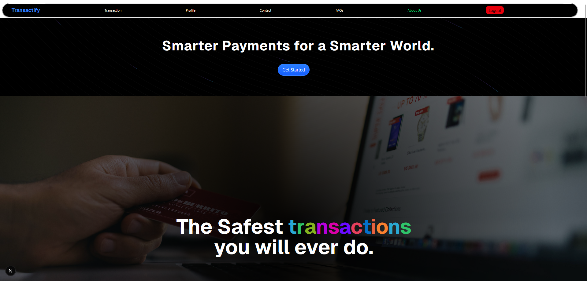
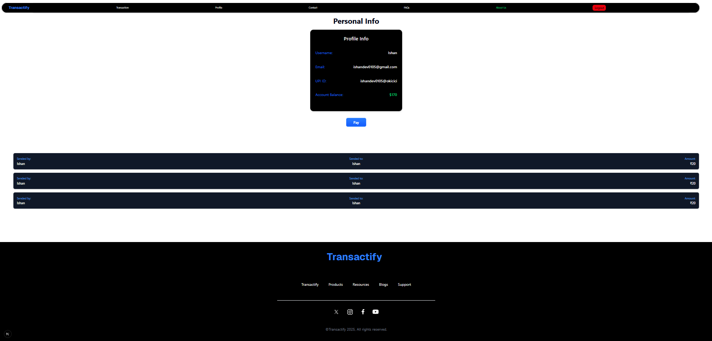
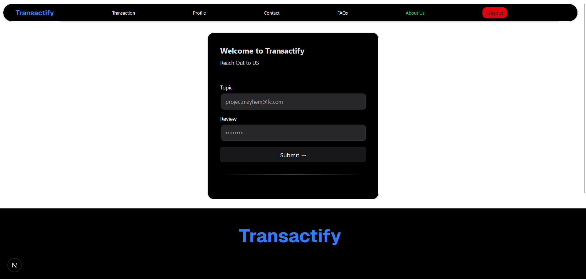
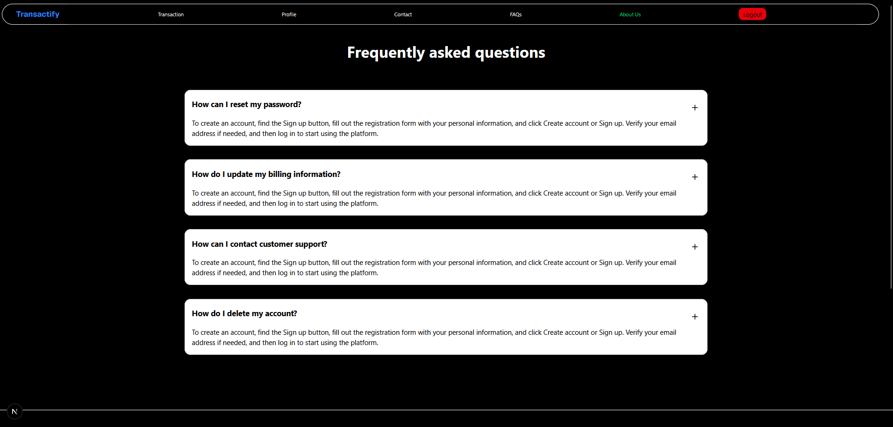
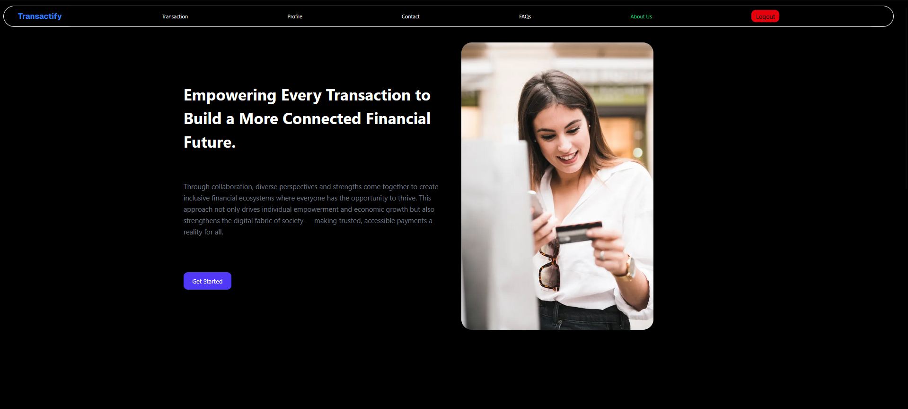
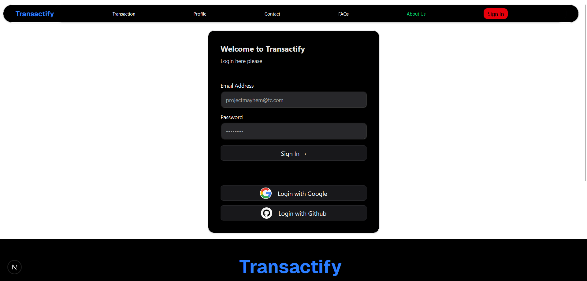

<h1 align="center">🚀 Transactify</h1>
<p align="center">
  <b>Money transfer app built with Next.js, PostgreSQL, NextAuth, and Razorpay</b><br>
  
  
  
  
  
  
</p>

---

## 🌐 Live Demo

👉 [Transactify on Vercel](https://transactify-three.vercel.app/)

---

## 🧰 Tech Stack

- **Frontend:** Next.js, Tailwind CSS, Shadcn, Acertnity UI
- **Backend:** Next.js API Routes
- **Database:** PostgreSQL + Prisma ORM
- **Authentication:** NextAuth.js
- **Payments:** Razorpay SDK (test mode)
- **Deployment:** Vercel

---

## ✨ Features

- 🔒 Secure authentication & user sessions
- 💸 Send/receive money via UPI ID or phone number
- ⚡ Razorpay payment integration
- 📜 Transaction history & logs
- 📱 Responsive UI (Tailwind CSS)
- 🚨 Error handling & toast notifications
- 👤 Google & GitHub OAuth support
- 🛡️ Encrypted data transfer
- 🧩 Modular, scalable codebase

---

## 🖼️ Screenshots

| Homepage | Transaction History | Profile |
|---|---|---|
|  |  |  |

| Contact Us | FAQ | About | Sign In |
|---|---|---|---|
|  |  |  |  |

---

## ⚡ Quick Start

```bash
git clone https://github.com/Webdev-Ishan/transactify.git
cd transactify
npm install
```

---

## 🔐 Environment Setup

Create a `.env` file in the root directory:

```env
DATABASE_URL=your_postgres_url
NODE_ENV=dev
SALT=your_bcrypt_salt
RESEND_API_KEY=your_resend_api_key
NEXT_AUTH_SECRET=your_auth_secret
GOOGLE_CLIENT_ID=your_google_client_id
GOOGLE_CLIENT_SECRET=your_google_client_secret
GITHUB_ID=your_github_id
GITHUB_SECRET=your_github_secret
RAZORPAY_ID=your_razorpay_id
RAZORPAY_SECRET=your_razorpay_secret
NEXT_PUBLIC_RAZORPAY_KEY_ID=your_razorpay_id
```

---

## 🛠️ Local Development

```bash
npx prisma generate
npx prisma db push
npm run dev
```

---

## 🤝 Contributing

1. Fork this repo
2. Create a feature branch
3. Commit your changes
4. Open a PR

---

## 🧑‍💼 Author

**Ishan Saini**  
[GitHub](https://github.com/Webdev-Ishan) • [LinkedIn](https://www.linkedin.com/in/ishan-saini/)

---

## 📄 License

MIT

---

<p align="center">
  <i>Transactify – Secure, fast, and modern money transfer for everyone.</i>
</p>